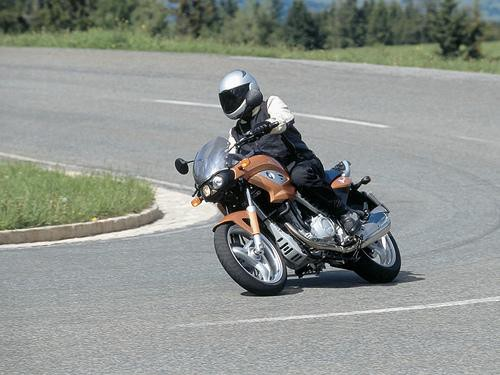
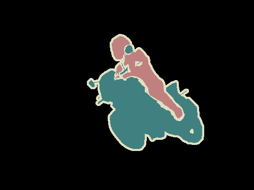
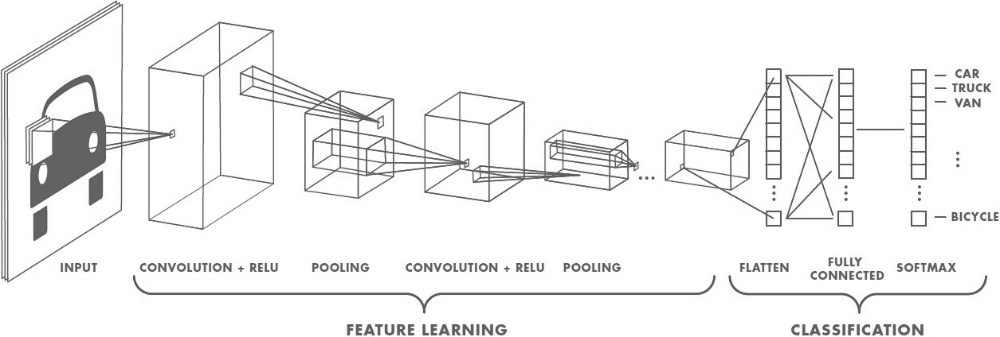
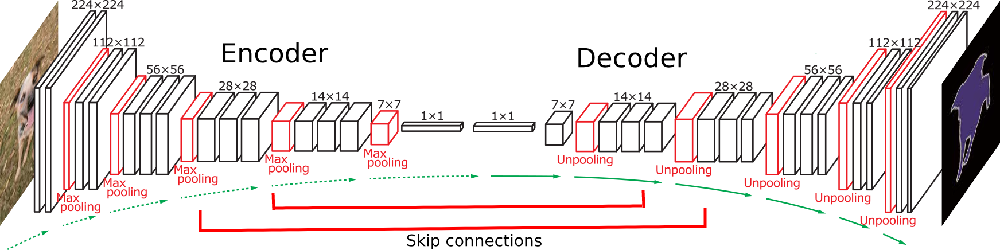

[](http://www.udacity.com/drive)
# Semantic Segmentation
This project makes use of deep learning concepts that was learned through first term of the Udacity's nanodegree. In this project, we will label the pixels of a road in images using a Fully Convolutional Network (FCN).

For few decades image segmentation was a complex task in computer vision. Image segmentation is different from image classification. In image classification, it will only classify objects that it has specific labels for such as horse, auto, house etc where as image segmentation algorithm will also segment unknown objects. Image segmentation is also known as semantic segmentation.

Orginal image:
<br/>

<br/>
<br/>
Image after segmentation:
<br/>


Before the deep learning influence in computer vision, other machine learning approaches such as Random forest where used to do the segmentation. Convolutional Neural Network(CNN) has enormous success in classifying the image in the past.




In typical CNN structure, input layer followed by convolution layer, then it is connected to fully connected layer followed softmax to classify the image. CNN is to classify if the image has got particular object, but it more difficult to answer "where is the object in the image". This is because of fully connected layer doesn't preserve spatial information. The FCN model is the solution for the spatial problem with connected layers.

Pooling layer is also one of the main problem, apart from fully connected layer, in CNN to preserve the spatial information. Pooling layer are able to aggregate the context while discarding the 'where' information. But in sematic segmentation, we need to preserver the 'where' context to map the each pixel to corresponding object class.



In order to tackle this issue encoder-decoder architecture is used where encoder gradually reduces the spatial dimension with pooling layers and decoder gradually recovers the object details and spatial dimension. Also use skip connections from encoder to decoder to help decoder recover the object details better.FCN is one of that type architecture which replace fully connected layer with decoder.


The project is based FCN8 which uses VGG16 as encoder. The first step is to load the downloaded VGG16 model.Then we load the VGG layer to get the input_layer, layer 3, layer 4, and layer 7 using load_vgg function we defined as part of the project.
```
input_layer, keep_prob_tensor, layer3, layer4, layer7 = load_vgg(sess, vgg_path)
```

Once we have the above layers from VGG19, then we define the second part of FCN, decoder. In decoder we need to convert the ouput of the above layers into 1x1 convolution and then upsample then using convolution transposed. Also we define the skip connection as par of this. We define these functionality under layers functions as mentioned below:
```

def layers(vgg_layer3_out, vgg_layer4_out, vgg_layer7_out, num_classes):
    """
    Create the layers for a fully convolutional network.  Build skip-layers using the vgg layers.
    :param vgg_layer3_out: TF Tensor for VGG Layer 3 output
    :param vgg_layer4_out: TF Tensor for VGG Layer 4 output
    :param vgg_layer7_out: TF Tensor for VGG Layer 7 output
    :param num_classes: Number of classes to classify
    :return: The Tensor for the last layer of output
    """
    
    # 1X1 connvolution of the layer 7
    conv_1x1_7th_layer = tf.layers.conv2d(vgg_layer7_out,num_classes, 1,padding = 'same',
                                     kernel_regularizer= tf.contrib.layers.l2_regularizer(1e-3),
                                     name='conv_1x1_7th_layer')
    # Upsampling x 4
    upsampling1 = tf.layers.conv2d_transpose(conv_1x1_7th_layer,
                                                num_classes,
                                                4,
                                                strides= (2, 2),
                                                padding= 'same',
                                                kernel_regularizer= tf.contrib.layers.l2_regularizer(1e-3),
                                                name='upsampling1')
    # 1X1 convolution of the layer 4
    conv_1x1_4th_layer = tf.layers.conv2d(vgg_layer4_out,
                                     num_classes,
                                     1,
                                     padding = 'same',
                                     kernel_regularizer= tf.contrib.layers.l2_regularizer(1e-3),
                                     name='conv_1x1_4th_layer')
    skip1 = tf.add(conv_1x1_4th_layer, upsampling1, name="skip1")

    # Upsampling x 4
    upsampling2 = tf.layers.conv2d_transpose(skip1,
                                    num_classes,
                                    4,
                                    strides= (2, 2),
                                    padding= 'same',
                                    kernel_regularizer= tf.contrib.layers.l2_regularizer(1e-3),
                                    name='upsampling2')

    # 1X1 convolution of the layer 3
    conv_1x1_3th_layer = tf.layers.conv2d(vgg_layer3_out,
                                     num_classes,
                                     1,
                                     padding = 'same',
                                     kernel_regularizer= tf.contrib.layers.l2_regularizer(1e-3),
                                     name='conv_1x1_3th_layer')
    skip2 = tf.add(conv_1x1_3th_layer, upsampling2, name="skip2")

    # Upsampling x 8.
    upsampling3 = tf.layers.conv2d_transpose(skip2, num_classes, 16,
                                                  strides= (8, 8),
                                                  padding= 'same',
                                                  kernel_regularizer= tf.contrib.layers.l2_regularizer(1e-3),
                                                  name='upsampling3')


    return upsampling3
```
Then we define the optimize function where corss entropy loss and optimiser is defined
```
def optimize(nn_last_layer, correct_label, learning_rate, num_classes):
    """
    Build the TensorFLow loss and optimizer operations.
    :param nn_last_layer: TF Tensor of the last layer in the neural network
    :param correct_label: TF Placeholder for the correct label image
    :param learning_rate: TF Placeholder for the learning rate
    :param num_classes: Number of classes to classify
    :return: Tuple of (logits, train_op, cross_entropy_loss)
    """
    # TODO: Implement function

    # Reshape the label same as logits 
    label_reshaped = tf.reshape(correct_label, (-1,num_classes))

    # Converting the 4D tensor to 2D tensor. logits is now a 2D tensor where each row represents a pixel and each column a class
    logits = tf.reshape(nn_last_layer, (-1, num_classes))

    # Name logits Tensor, so that is can be loaded from disk after training
    logits = tf.identity(logits, name='logits')

    # Loss and Optimizer
    cross_entropy_loss = tf.reduce_mean(tf.nn.softmax_cross_entropy_with_logits(logits=logits, labels=label_reshaped))

    reg_losses = tf.get_collection(tf.GraphKeys.REGULARIZATION_LOSSES)
    reg_constant = 1e-3
    loss = cross_entropy_loss + reg_constant * sum(reg_losses)

    train_op = tf.train.AdamOptimizer(learning_rate= learning_rate).minimize(loss)    
    
    return logits, train_op, loss
```
Final step for training the model is to defining the hyperparameters and looping the images through the function mentioned above.
```   
   sess.run(tf.global_variables_initializer())
    
    # Training cycle
    for epoch in range(epochs):
        print("Epoch {}".format(epoch + 1))
        training_loss = 0
        training_samples_length = 0
        for image, label in get_batches_fn(batch_size):
            training_samples_length += len(image)
            _, loss = sess.run([train_op, cross_entropy_loss], feed_dict={
                input_image: image,
                correct_label: label,
                keep_prob: 0.5,
                learning_rate: 0.0001
            })
            training_loss += loss
            print(loss)
        
        # Total training loss
        training_loss /= training_samples_length
        print("********************Total loss***********************")
        print(training_loss)
 ```
Hyperparameters we end up choose is Epochs = 50 and batch_size=5.

Here is the few images we are managed to do image segmentation. Please remember, we only consider two classes: road or not road.
